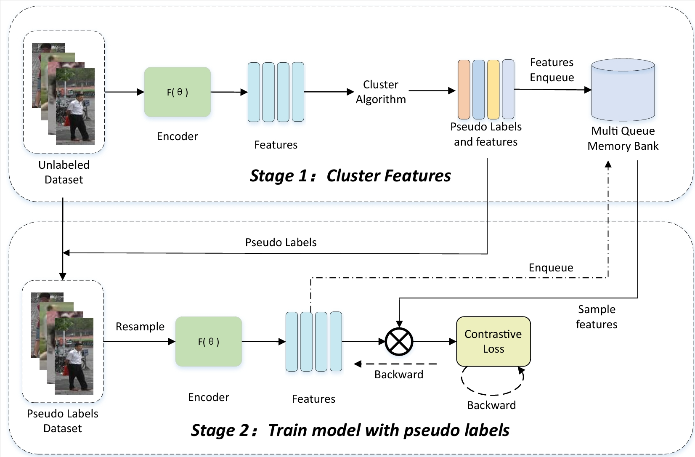
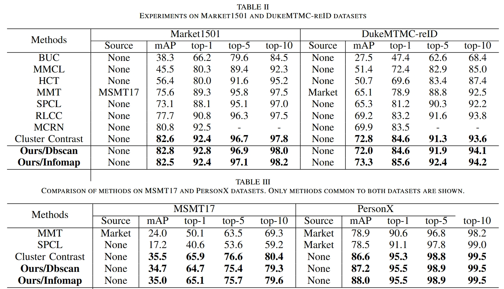

# Cluster Contrast for Unsupervised Person Re-Identification

**Our unified framework**


## Requirements

### Installation

```shell
git clone https://github.com/alibaba/cluster-contrast-reid.git
cd ClusterContrast
python setup.py develop
# conda install environment
# conda install pytorch==1.12.1 torchvision==0.13.1 torchaudio==0.12.1 cudatoolkit=10.2 faiss-gpu tensorboardX h5py  -c pytorch
```

### Prepare Datasets

```shell
cd examples && mkdir data
```
Download the person datasets Market-1501,MSMT17,PersonX,DukeMTMC-reID and the vehicle datasets VeRi-776 from [aliyun](https://virutalbuy-public.oss-cn-hangzhou.aliyuncs.com/share/data.zip).
Then unzip them under the directory like

```
ClusterContrast/examples/data
├── market1501
│   └── Market-1501-v15.09.15
├── msmt17
│   └── MSMT17_V1
├── personx
│   └── PersonX
├── dukemtmcreid
│   └── DukeMTMC-reID
└── veri
    └── VeRi
```


## Training

We utilize 4 TITAN-Xp GPUs for training. For more parameter configuration, please check **`run_code.sh`**.

**examples:**

1. Using DBSCAN:
```shell
# datasets including market501, msmt17, dukemtmcreid, personx and veri
# you can add new dataset at multiqueue/datasets

# Without use trainable temperature
CUDA_VISIBLE_DEVICES=0,1,2,3 python examples/multi_queue_usl_notemp.py -b 256 -a resnet50 -d market1501 --iters 200 --momentum 0.1 --eps 0.6 --num-instances 16 --lr 0.00035 --epochs 50

# Use trainable temperature 
CUDA_VISIBLE_DEVICES=0,1,2,3 python examples/multi_queue_usl.py -b 256 -a resnet50 -d market1501 --iters 200 --momentum 0.1 --eps 0.6 --num-instances 16 --lr 0.00035 --epochs 50
```


2. Using InfoMap:
```shell
# Without use trainable temperature
 CUDA_VISIBLE_DEVICES=0,1,2,3 python examples/multi_queue_info_notemp.py -b 256 -a resnet50 -d market1501 --iters 200 --momentum 0.1 --eps 0.5 --k1 15 --k2 4 --num-instances 16 --lr 0.00035 --epochs 50

# Use trainable temperature 
 CUDA_VISIBLE_DEVICES=0,1,2,3 python examples/multi_queue_infomap.py -b 256 -a resnet50 -d market1501 --iters 200 --momentum 0.1 --eps 0.5 --k1 15 --k2 4 --num-instances 16 --lr 0.00035 --epochs 50

```

3. Running Ablation Experiments
```shell
# Never hang up the training process, which can prevent interruptions caused by server disconnections 
nohup sh ablation_temp.sh > output/multi_queue.txt
nohup sh ablation_notemp.sh > output/multi_queue_notemp.txt
```


## Results
Training on 2 GTX1080, you can get results as followed.  
```shell
CUDA_VISIBLE_DEVICES=0,1 python examples/multi_queue_usl.py -b 128 -a resnet50 -d market1501 --iters 200 --momentum 0.1 --eps 0.6 --num-instances 16 --lr 0.000175 --epochs 100
 CUDA_VISIBLE_DEVICES=0,1 python examples/multi_queue_infomap.py -b 128 -a resnet50 -d market1501 --iters 200 --momentum 0.1 --eps 0.5 --k1 15 --k2 4 --num-instances 16 --lr 0.00175 --epochs 100
```


# Acknowledgements

Thanks to Yixiao Ge for opening source of her excellent works  [SpCL](https://github.com/yxgeee/SpCL). 

Thanks to Dai for opening source of his excellent works  [Cluster Contrast](https://github.com/alibaba/cluster-contrast-reid.git). 
